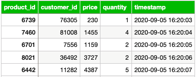

# MySQL Online Transactional Processing Database

> SoftCart will be using MySQL for our online transactional processing, such as storing inventory and sales data. Based on the sample data given, design the database schema and create a database to store our sales data. Create an index on the timestamp column and write an administrative bash script that exports sales data into a SQL file.

## Database Schema


Based on the sample data given, the schema will contain the following columns:
- `product_id`
- `customer_id`
- `price`
- `quantity`
- `timestamp`

The sales data will be stored in a table named `sales_data` located in a database named `sales`

## 1. Create The Database
Now that the schema is designed, I will use the following SQL statement to create our `sales` database.
```sql
CREATE DATABASE sales;
```

Next, I will use the following statement to create our `sales_data` table to store sales transactions.
- None of the columns should allow `NULL`
- Data type `INT` was used for the `price` column instead of `FLOAT`, based on the sample data given.
```sql
CREATE TABLE `sales_data` (
	`product_id` INT NOT NULL,
	`customer_id` INT NOT NULL,
	`price` INT NOT NULL,
	`quantity` INT NOT NULL,
	`timestamp` TIMESTAMP NOT NULL ON UPDATE CURRENT_TIMESTAMP
);
```

## 2. Load Sample Data & Test Queries
After downloading the sample data `oltpdata.csv`, I will import it into `sales_data` using phpMyAdmin.
> ```
> Import has been successfully finished, 2605 queries executed. (oltpdata.csv)
> ```

Next, I will use the MySQL CLI to list the tables in the sales database.
```sql
USE sales;
```
```sql
SHOW tables;
```
> ```
> +-----------------+
> | Tables_in_sales |
> +-----------------+
> | sales_data      |
> +-----------------+
> 1 row in set (0.01 sec)
> ```

Next, I will write a simple test query to display the record count from `sales_data`.
```sql
SELECT COUNT(*)
FROM sales_data;
```
> ```
> +----------+
> | COUNT(*) |
> +----------+
> |     2605 |
> +----------+
> 1 row in set (0.00 sec)
> ```

## 3. Set Up Administration Tasks
First I need to create an index named `ts` on the timestamp column.
```sql
CREATE INDEX ts ON sales_data (timestamp);
```
> ```
> Query OK, 0 rows affected (0.09 sec)
> Records: 0  Duplicates: 0  Warnings: 0
> ```

Using the following command, I will list all indexes from `sales_data` to confirm the creation of the `ts` index.
```sql
SHOW INDEX FROM sales_data;
```
> ```
> +------------+------------+----------+--------------+-------------+-----------+-------------+----------+--------+------+------------+---------+---------------+---------+------------+
> | Table      | Non_unique | Key_name | Seq_in_index | Column_name | Collation | Cardinality | Sub_part | Packed | Null | Index_type | Comment | Index_comment | Visible | Expression |
> +------------+------------+----------+--------------+-------------+-----------+-------------+----------+--------+------+------------+---------+---------------+---------+------------+
> | sales_data |          1 | ts       |            1 | timestamp   | A         |        2605 |     NULL |   NULL |      | BTREE      |         |               | YES     | NULL       |
> +------------+------------+----------+--------------+-------------+-----------+-------------+----------+--------+------+------------+---------+---------------+---------+------------+
> 1 row in set (0.00 sec)
> ```

The timestamp index has been successfully created. Now I will write a bash script `datadump.sh` that exports all records from `sales_data` into a SQL file named `sales_data.sql`.

```console
sudo touch datadump.sh
```
```console
sudo nano datadump.sh
```

With the nano editor, I will write the following bash script using `mysqldump` to export the records:
```console
#!/bin/bash
mysqldump -u root -p sales sales_data > sales_data.sql
```

After saving the file and exiting the editor, I need to update the permissions so the script can be executed.
```console
sudo chmod u+x datadump.sh
```

Now our `sales_data` export process can be automated or executed manually with the following command:
```console
sudo ./datadump.sh
```

## About This Lab
##### Environment/IDE
This portion of the project will be using the Cloud IDE based on Theia and MySQL running in a Docker container.

##### Tools/Software
- MySQL 8.0.22
- phpMyAdmin 5.0.4

[<kbd> <br> → Next Assignment <br> </kbd>](/02%20-%20MongoDB%20NoSQL%20Catalog%20Database)
