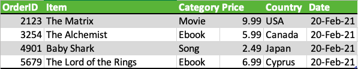
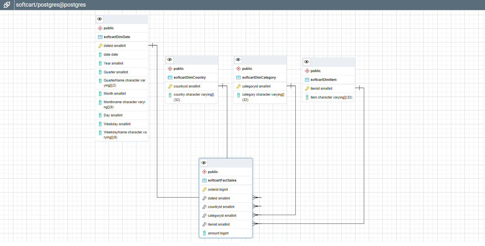

# PostgreSQL Staging Data Warehouse
> Sales data from MySQL and catalog data from MongoDB will be periodically extracted and stored into a staging data warehouse running on PostgreSQL. The data will then be transformed and loaded into a production data warehouse running on IBM Db2 to generate reports such as:
> - total sales per year per country
> - total sales per month per category
> - total sales per quarter per country
> - total sales per category per country
> 
> Design a data warehouse star schema using the pgAdmin ERD design tool, ensuring the table can generate yearly, monthly, daily, and weekly reports. Export the schema SQL and create a staging database. Your Senior Data Engineer will then review your schema design. Make any necessary adjustments before moving to the next phase.

## Data Warehouse Schema


Based on the sample order data and report requirements, the fact of measure will be constructed in the following table:
- `softcartFactSales`
   - <b>orderid</b> <sup><sub>PRIMARY KEY</sub></sup>
   - <b>dateid</b> <sup><sub>FOREIGN KEY</sub></sup>
   - <b>categoryid</b> <sup><sub>FOREIGN KEY</sub></sup>
   - <b>countryid</b> <sup><sub>FOREIGN KEY</sub></sup>
   - <b>itemid</b> <sup><sub>FOREIGN KEY</sub></sup>
   - <b>amount</b>

and will contain the following dimensions:
- `softcartDimDate`
   - <b>dateid</b> <sup><sub>PRIMARY KEY</sub></sup>
   - <b>date</b>
   - <b>Year</b>
   - <b>Quarter</b>
   - <b>QuarterName</b>
   - <b>Month</b>
   - <b>MonthName</b>
   - <b>Day</b>
   - <b>Weekday</b>
   - <b>WeekdayName</b>
- `softcartDimCategory`
   - <b>categoryid</b> <sup><sub>PRIMARY KEY</sub></sup>
   - <b>category</b>
- `softcartDimCountry`
   - <b>countryid</b> <sup><sub>PRIMARY KEY</sub></sup>
   - <b>country</b>
- `softcartDimItem`
   - <b>itemid</b> <sup><sub>PRIMARY KEY</sub></sup>
   - <b>item</b>

## 1. pgAdmin ERD Star Schema Design
I will start by creating a temporary database `softcart` to design the star schema using pgAdmin's ERD Design Tool. Next, I will create tables for each dimension/fact and design the relationships between them.



## 2. Export Schema
With the star schema designed, I can now export it as SQL and create our `staging` database.
```sql
-- This script was generated by a beta version of the ERD tool in pgAdmin 4.
-- Please log an issue at https://redmine.postgresql.org/projects/pgadmin4/issues/new if you find any bugs, including reproduction steps.
BEGIN;


CREATE TABLE public."DimCategory"
(
    categoryid smallint NOT NULL,
    category character varying(32)[] NOT NULL,
    PRIMARY KEY (categoryid)
);

CREATE TABLE public."DimCountry"
(
    countryid smallint NOT NULL,
    country character varying(32)[] NOT NULL,
    PRIMARY KEY (countryid)
);

CREATE TABLE public."DimDate"
(
    dateid smallint NOT NULL,
    date date NOT NULL,
    "Year" smallint NOT NULL,
    "Quarter" smallint NOT NULL,
    "QuarterName" character varying(2)[] NOT NULL,
    "Month" smallint NOT NULL,
    "Monthname" character varying(9)[] NOT NULL,
    "Day" smallint NOT NULL,
    "Weekday" smallint NOT NULL,
    "WeekdayName" character varying(9)[] NOT NULL,
    PRIMARY KEY (dateid)
);

CREATE TABLE public."FactSales"
(
    orderid bigint NOT NULL,
    dateid smallint NOT NULL,
    countryid smallint NOT NULL,
    categoryid smallint NOT NULL,
    amount bigint NOT NULL,
    PRIMARY KEY (orderid)
);

ALTER TABLE public."FactSales"
    ADD FOREIGN KEY (dateid)
    REFERENCES public."DimDate" (dateid)
    NOT VALID;


ALTER TABLE public."FactSales"
    ADD FOREIGN KEY (countryid)
    REFERENCES public."DimCountry" (countryid)
    NOT VALID;


ALTER TABLE public."FactSales"
    ADD FOREIGN KEY (categoryid)
    REFERENCES public."DimCategory" (categoryid)
    NOT VALID;

END;
```

```shell
COMMIT

Query returned successfully in 181 msec.
```

## About This Lab
##### Environment/IDE
This portion of the project will be using the Cloud IDE based on Theia and PostgreSQL database running in a Docker container.

##### Tools/Software
- ERD Design Tool of pgAdmin
- PostgreSQL Database Server

[<kbd> <br> ← Previous Assignment <br> </kbd>](/02%20-%20MongoDB%20NoSQL%20Catalog%20Database)
[<kbd> <br> → Next Assignment <br> </kbd>](/04%20-%20IBM%20Db2%20Production%20Data%20Warehouse)
