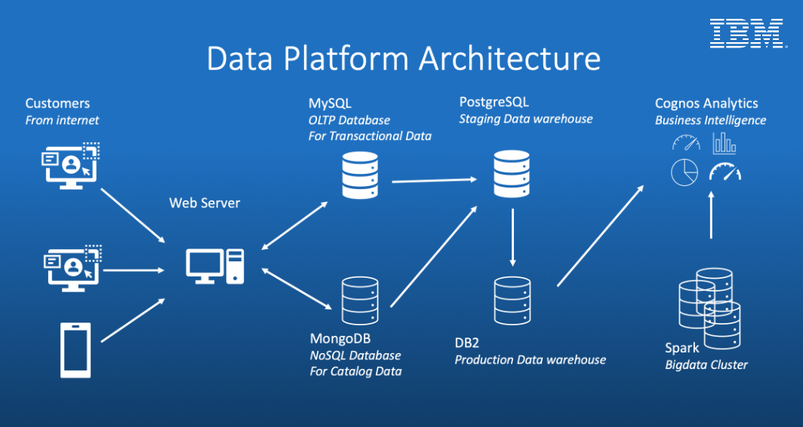

# IBM Data Engineering Capstone Project
In this project, I will assume the role of a Junior Data Engineer who has recently joined a fictional online e-Commerce company named SoftCart. I will be presented with real-world use cases that will require me to apply a number of industry standard data engineering solutions.

## Objectives
- Demonstrate proficiency in skills required for an entry-level data engineering role
- Design and implement various concepts and components in the data engineering lifecycle such as data repositories
- Showcase working knowledge with relational databases, NoSQL data stores, big data engines, data warehouses, and data pipelines
- Apply skills in Linux shell scripting, SQL, and Python programming languages to Data Engineering problems

## Project Outline
- SoftCart's online presence is primarily through its website, which customers access using a variety of devices like laptops, mobiles and tablets.
- All the catalog data of the products is stored in the MongoDB NoSQL server.
- All the transactional data like inventory and sales are stored in the MySQL database server.
- SoftCart's webserver is driven entirely by these two databases.
- Data is periodically extracted from these two databases and put into the staging data warehouse running on PostgreSQL.
- Production data warehouse is on the cloud instance of IBM DB2 server.
- BI teams connect to the IBM DB2 for operational dashboard creation. IBM Cognos Analytics is used to create dashboards.
- SoftCart uses Hadoop cluster as it big data platform where all the data collected for analytics purposes.
- Spark is used to analyse the data on the Hadoop cluster.
- To move data between OLTP, NoSQL and the dataware house ETL pipelines are used and these run on Apache Airflow.

## Assignment Briefs

### 1. MySQL Online Transactional Processing Database
SoftCart will be using MySQL for our online transactional processing, such as storing inventory and sales data. Based on the sample data given, design the database schema and create a database to store our sales data. Create an index on the timestamp column and write an administrative bash script that exports sales data into a SQL file.

### 2. MongoDB NoSQL Catalog Database
All of SoftCart's catalog data will be stored on a MongoDB NoSQL server. Create the database `catalog` and import our electronics products from `catalog.json` into a collection named `electronics`. Run test queries against the data and export the collection into a file named `electronics.csv` using only the `_id`, `type`, and `model` fields.

### 3. PostgreSQL Staging Data Warehouse
Sales data from MySQL and catalog data from MongoDB will be periodically extracted and stored into a staging data warehouse running on PostgreSQL. The data will then be transformed and loaded into a production data warehouse running on IBM Db2 to generate reports such as:
- total sales per year per country
- total sales per month per category
- total sales per quarter per country
- total sales per category per country

Design a data warehouse star schema using the pgAdmin ERD design tool, ensuring the table can generate yearly, monthly, daily, and weekly reports. Export the schema SQL and create a staging database. Your Senior Data Engineer will then review your schema design. Make any necessary adjustments before moving to the next phase.

### 4. IBM Db2 Production Data Warehouse
Using the adjusted schema design, create an instance of IBM DB2 and load the sample datasets into their respective tables. Write aggregation queries and create a Materialized Query Table for future reports.

### 5. Python Scripts & Automation
SoftCart needs to keep data synchronized between different databases/data warehouses as a part of our daily routine. One task that is routinely performed is the sync up of staging data warehouse and production data warehouse. Write a script that will automate the process of regularly updating the DB2 instance with new records from MySQL.

### 6. Apache Airflow ETL & Data Pipelines
SoftCart has imported web server log files as `accesslog.txt`. Write an Airflow DAG pipeline that analyzes the log files, extracts the required lines and fields, transforms and loads the data to an existing file.

### 7. Apache Spark Big Data Analytics
Our team has prepared a set of data containing search terms on our e-Commerce platform. Download the data and run analytic queries on it using `pyspark` and `JupyterLab`. Use a pretrained sales forecasting model to predict the sales for 2023.

## Tools/Software
- **OLTP Database** - MySQL
- **NoSql Database** - MongoDB
- **Production Data Warehouse** – DB2 on Cloud
- **Staging Data Warehouse** – PostgreSQL
- **Big Data Platform** - Hadoop
- **Big Data Analytics Platform** – Spark
- **Business Intelligence Dashboard** - IBM Cognos Analytics
- **Data Pipelines** - Apache Airflow

## About This Project
This project is part of the IBM Data Engineering Professional Certificate program, offered by IBM Skills Network and hosted on Coursera.

Read more: https://www.coursera.org/learn/data-enginering-capstone-project
